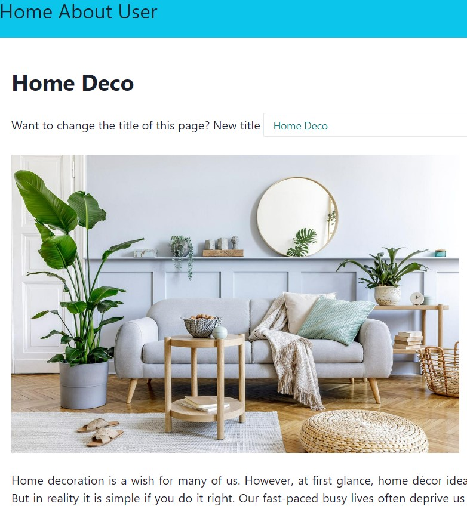
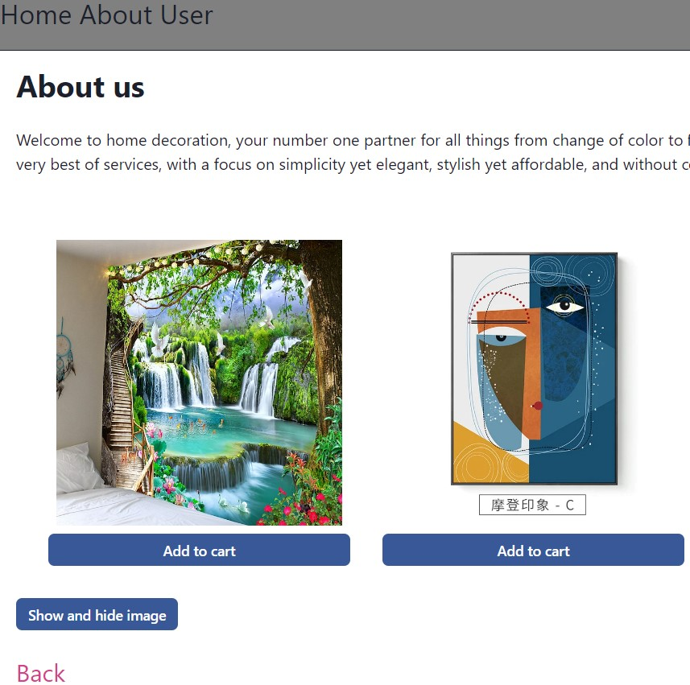
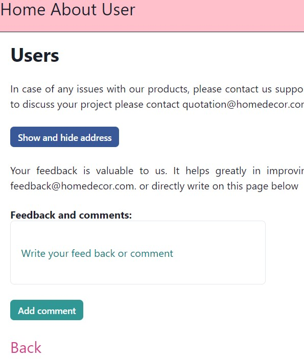

# React project report

## Objective of the project 
The goal of the project to build a ReactJS or ReactTS frontend that uses React-Hooks to build functional components. The application must also use Routing in such a way that it meets the requirement for a SPA. The functional components that have a GUI must be responsive. The application should be created using react-router-dom. The application must make use of the following things:
<ul>
  <li>at least 1 of the built-in hooks in the React
library</li>
  <li>at least 1 value must be passed down the component hierarchy using Props</li>
  <li>routing must take place according to SPA</li>
  <li>your components must be responsive</li>
  <li>use a components library to create and style your
components, such as ChakraUI</li>
</ul> 

## Planning

I have extended my inlämning task to the  project work. I have kept the same three pages Home, About and Users that was created using SPA (single page application). I have used useEffect hook and useState hook on all pages. I have used these hooks to change the title and add feedback on the user's page. 

I have designed a home-decor webside with minimal content. The main focus is to use react functions and hooks. The webside  advertises products and also receive the feedback on user.

I have done the following additions in the project task:
<li>Used ChakraUI and changed the tags accordingly</li>
<li>Added an add to cart button on the About page and designed a counter to count the number of added items in the cart</li>
<li>Added more styling</li>
<li>some adjustment</li>

## About the website

The home page contains a short description about the home decoration and provide option to change the title of the page and document. It also counts how many times a user has changed the document's title. 

The about page describes the products and has some images of the products. Two react hooks are used on this page. One hook is used to show and hide the image on this page. The second hook is used as counter to count the number of items added to the cart.

The user page is designed for the customer to contact us. The page provides an option to directly write an email or write a feedback directly on the page. The feedback is updated on the page using useEffect and useState hooks. 

*Sania Athar*